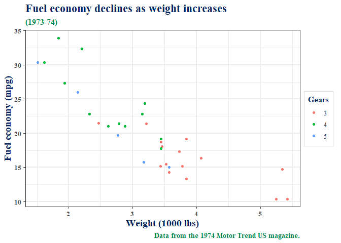

<!-- README.md is generated from README.Rmd. Please edit that file -->

# Linkplots

<!-- badges: start -->
<!-- badges: end -->

The goal of Linkplots is to easily generate plots with LinkPact
graphical style.

## Installation

You can install the released version of Linkplots from
[GitHub](https://github.com/) with:

``` r
# install.packages("devtools")
devtools::install_github("GuillaumeBiessy/Linkplots")
```

## Example

This is a basic example which shows you how to solve a common problem:

``` r
library(Linkplots)
## basic example code

library(ggplot2)

  theme_LinkPact() |> theme_set()

  mtcars2 <- within(mtcars, {
    vs <- factor(vs, labels = c("V-shaped", "Straight"))
    am <- factor(am, labels = c("Automatic", "Manual"))
    cyl  <- factor(cyl)
    gear <- factor(gear)
  })

  p1 <- ggplot(mtcars2) +
    geom_point(aes(x = wt, y = mpg, colour = gear)) +
    labs(title = "Fuel economy declines as weight increases",
         subtitle = "(1973-74)",
         caption = "Data from the 1974 Motor Trend US magazine.",
         x = "Weight (1000 lbs)",
         y = "Fuel economy (mpg)",
         colour = "Gears")

p1
```



``` r
p1 + facet_grid(vs ~ am)
```


